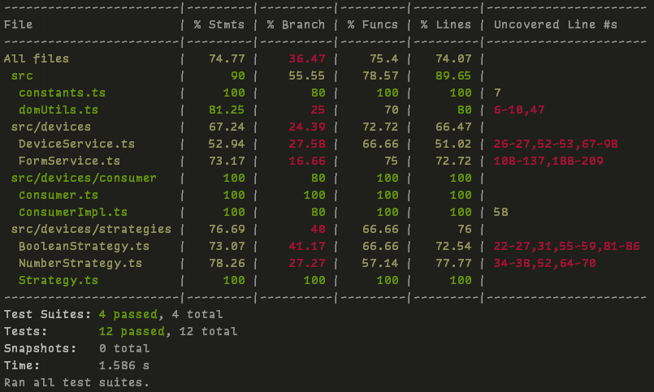
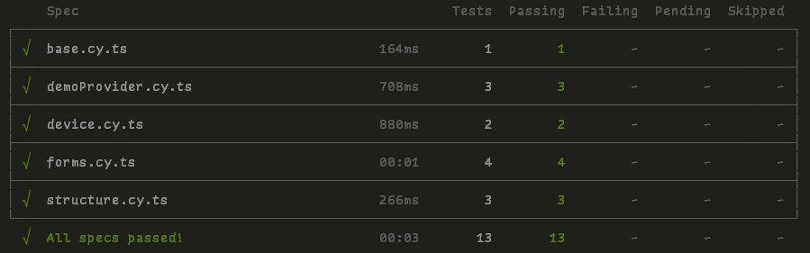

# (Adobe) Home Automation Assessment

> First Commit: 2022-06-03

> Last Commit: 2022-06-06

> Contact: M. Voss

- [Assigment](#assigment)
    - [Task](#task)
    - [Interpretation](#interpretation)
- [How to run](#how-to-run)
- [Documentation](#documentation)
    - [Testing (Unit + E2E)](#testing-unit--e2e)
    - [Implementation](#implementation)
    - [Demo Content](#demo-content)
- [ToDos](#todos)
    - [Submission](#submission)
    - [Known Issues](#known-issues--future-extensions)
- [References](#references)

## Assigment

### Task

> [...] provide the following: A JavaScript application simulating house automation: pressing a button on a control
> panel would visually turn on a light, change the temperature or close the curtains.
> Plain JavaScript / TypeScript only.
> Clientside Scripts only.
> Make it extensible and write Documentation.
> Bonus Points for Test Cases

### Interpretation

Write JavaScript that enables the (browser) pages visitor to add new (smart home) devices of type X, where X can be
anything such as a light switch, heating or window blinds.
To facilitate this generic approach, the implemented logic should be able to handle multiple kind of input/output types.

The simplest example is the "on / off (boolean value)" state for any electric circuit (e.g lightswitch).
This could be extended by adding multiple light sources to the same switch.
Additionally, one could imagine that the light itself is dimmamble -> the app needs to handle float values now.

I am envisioning a dashboard that consists of three different panes.
A form to add a new device.
A panel to control such added devices, as well as a panel that visualizes each device's state.

The communication between the "hub" (control dashboard) and its devices is a "publish / subscribe" architecture.
In larger applications, this would be handled by a messsage queue, such as Apache Kafka or RabbitMQ.
However, due to the size and constrains of this app, I will try to build something similar, but simplified.

The "configuration"
panel publishes state changes for a topic and all devices that subscribe to this topic consume that update.

On a side note, I am keeping any frontend styling to a minimum and simple,
since I want to focus on the underlying logic and not "waste" time.

## How to run

**Note, I've copied the "final" production build fragments to `/assignment`.**
I'm fully aware that build-fragments should not be added to version control in a "regular" project.

> Development

1. `$ npm run build`
2. Serve `/index.html` from HTTP server and open in any modern browser
    1. e.g `$ npm run serve` to use esbuild built in development server
    2. Alternatively, run `$ npm run watch` to listen for changes and auto-compile in the background

> Production

1. `$ npm run build-prod`
2. Open `/index.html` in any modern browser
    1. index.html references the scripts and stylesheets.
    2. Everything runs self-contained when served from an HTTP server

> Run pre-built '/assignment' artifacts

1. `$ npm run serve-prod`
    1. This uses esbuild built-in HTTP server to 'serve' the built files.
    2. The path is hardcoded to `/assignment` to where I've manually copied the latest built artifacts

## Documentation

### Testing (Unit + E2E)

I've tested **every** ui functionality available as well as the div structure with CypressIO E2E tests.
These run heedlessly during every production build.

Additionally, I've written jest unit tests for most of the backend functionality and element creation.
Jest test cases run on dev and prod builds.

Jest Unit Tests



Cypress (Chrome + Firefox Dev) E2E Tests



### Implementation

> Production Artifacts

- Entry-file Html: `assignment/index.html`
- Entry-file Scripts: `assignment/index.js`
- Entry-file Stylesheets: `assignment/index.css`

This project uses [esbuild](https://esbuild.github.io/) to bundle and transpile the typescript code into a single,
portable `index.js`.
This script is being referenced by the `index.html`, which additionally loads all stylesheets via a single `index.css`.
I've opted out of adding any SASS Plugins to keep this setup as simple as possible.

The html structure is broken down into three main sections.

- Form Container to create new Provider and Consumer
- Control Dashboard to emit Events
- Visualization Panel of Consumers and their event handling

The apps' logic in its basic form is as follows:

A Provider of type Strategy X sends a data object, the 'new'
value, as an event to the specified event type, here called **topic**.

Each consumer of type Strategy X has an event listener for a specific topic.
On event dispatch this consumer updates its internal state
(here its visual representation in html) according to its strategy implementation.

An example would be a light switch (provider) that's connected with a cable
(topic) to any number of light bulbs (consumer).

To be able to handle multiple use cases (here 'Strategies'),
each provider and consumer have a specific Strategy assigned.
This allows the underlying logic to be generic
and makes it easy to implement new features such as a color-picker variation
(Imagine an RGB Light bulb) for example.

In the current implementation, only one provider can be created per topic.
However, this is just due to the form validation.
One can either deactivate it:

```javascript
// generateProviderForm L129+

if (true) {
    // [...]
}
```

or adapt it to only add a new topic `<option/>` if it doesn't already exist.
Multiple provider for the same topic represents a set of switches that control the same set of lights, for example.

### Demo Content


The app comes with a set of demo providers and consumers already added.
Remove the following line in `/index.ts`, to disable this behaviour:

```javascript
// Load Demo Content
document.getElementById('load-demo-button')?.click()
```

You are now able to manually load the demo content via a button click.

## ToDos

- [x] Initial Repository Setup
- [x] Build and Development Setup
    - [x] Integrate esbuild
    - [x] Setup Typescript
    - [x] ~~Integrate SASS~~ lets keep it simple
    - [x] Ensure that the production build works and runs independently of this project
- [x] Add Jest Setup for unit tests
- [x] create "dummy" provider element + event
- [x] create "dummy" consumer element
- [x] create generic provider
- [x] create generic consumer
- [x] start with a device creation form
    - independently create provider and consumer
    - [x] form validation do not allow duplicate topic
    - [ ] ~~wrap each input/label line in div and style it~~
- [x] dynamically create provider
- [x] dynamically create consumer
    - setup listeners during creation
    - ensure that multiple consumers are able to listen to the same event topic
- [x] investigate how the strategy pattern could be used
- Must have Device Types / Strategies
    - [x] boolean -> light on/off, blinds open/closed
    - [x] float 0-1 -> e.g dimmable light
    - [x] float -> heating
- Nice to have Device Types
    - [ ] color (picker/value) -> rgb lights
    - [ ] set timer for X -> close blinds at 12pm
    - [ ] simple "button" strategy / alternative to checkbox
        - can we extend bool strategy?
- [ ] write the rest of the technical documentation
- [x] use more `data-` attributes as resilient dom selectors
- [x] Setup skeleton div structure
- [ ] ~~add localStorage "cache" / "state" to preserve *something* during page refresh~~
    - [x] add "load demo state" button instead?
- [x] add jest testcases
- [x] add cypress e2e testcases
- [x] add table of contents to README

### Submission

- [ ] add updated Demo Screenshot to README
- [ ] record short demo video
- [ ] update "last commit" date in README
- [ ] Copy "final" build files to `/assignment`
    - index.html
    - index.js
    - index.css
    - /css/*.css

### Known Issues / Future Extensions

- ~~Consumer Form tries to submit twice. However, validation correctly blocks the second submission.~~
- When adding a new consumer, it does not automatically grab the current state of its corresponding provider
- Currently, not possible to delete a consumer or a topic, once added.
- Add more test cases, especially for the event listeners, although this is quite tricky.
- Responsive Layout
- Update Provider Form Validation to allow multiple providers with the same topic
    - Imagine multiple light switches that control the same light bulb

## References

- <https://esbuild.github.io/>
- <https://dev.to/marcinwosinek/esbuild-in-a-simple-html-js-usecase-h1d>
- <https://css-tricks.com/lets-create-a-lightweight-native-event-bus-in-javascript/>
- <https://pierfrancesco-soffritti.medium.com/create-a-simple-event-bus-in-javascript-8aa0370b3969>
- <https://www.w3schools.com/html/html_forms.asp>
- <https://www.dofactory.com/javascript/design-patterns/strategy>
- <https://refactoring.guru/design-patterns/strategy/typescript/example>
- <https://developer.mozilla.org/en-US/docs/Web/Events/Creating_and_triggering_events>
- <https://medium.com/geekculture/html-event-handling-in-typescript-b9ca7178d912>
- <https://www.freecodecamp.org/news/form-validation-with-html5-and-javascript/>
